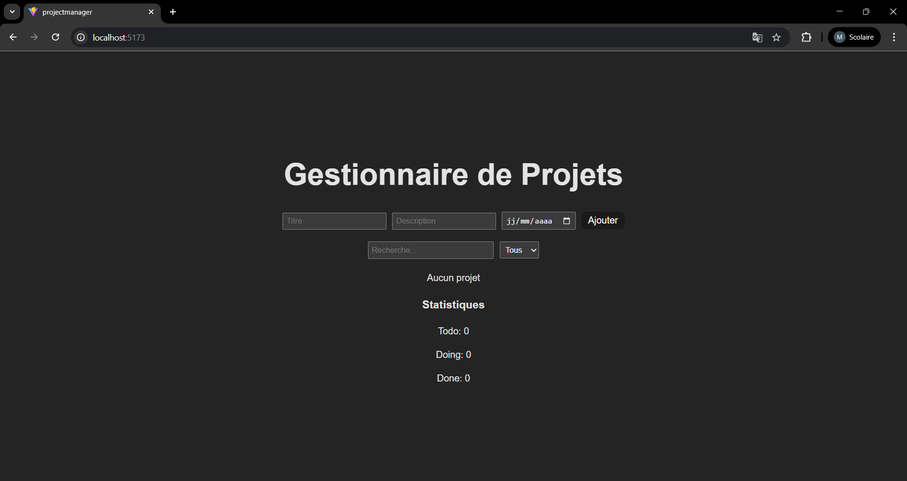
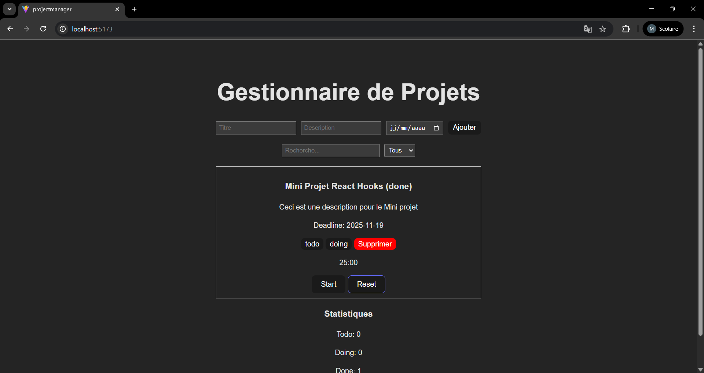
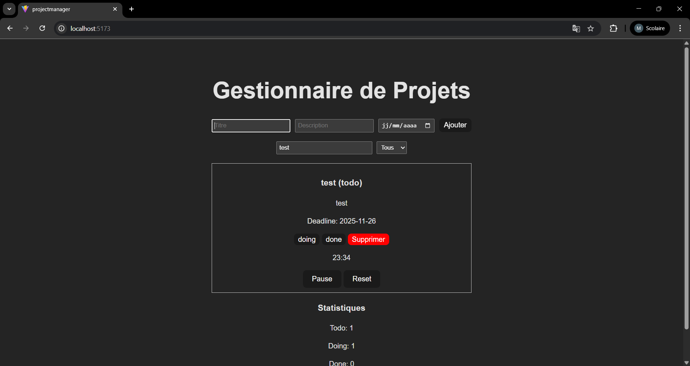
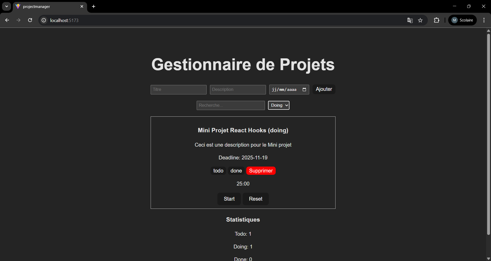
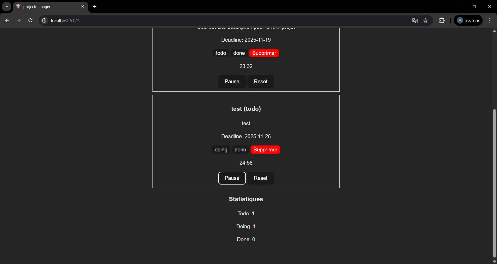
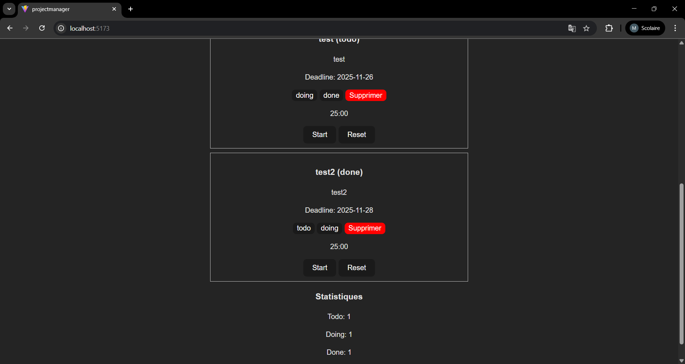

# Gestionnaire de Projets

Une application de gestion de projets construite avec React et Vite, utilisant les Hooks React (useState, useReducer, useEffect) pour la gestion d'état et les effets de bord.

## 🚀 Installation

1. Clôner le dépôt :
```bash
git clone https://github.com/MedRiadh2001/ProjectManger.git
cd ProjectManger
```

2. Installer les dépendances :
```bash
npm install
```

3. Lancer l'application en mode développement :
```bash
npm run dev
```

4. L'application sera accessible sur `http://localhost:5173`


## 🎯 Fonctionnalités

- ✅ Ajout, modification et suppression de projets
- 🔍 Recherche de projets par titre ou description
- 🏷️ Filtrage par statut (Todo, Doing, Done)
- ⏱️ Timer Pomodoro intégré pour chaque projet
- 📊 Statistiques des projets par statut
- 💾 Sauvegarde automatique dans le localStorage

## 📚 Explication du Reducer

Le reducer (`projectReducer.js`) gère toutes les actions liées aux projets. Il utilise le pattern Reducer de React pour centraliser la logique de mise à jour de l'état.

### Structure du Reducer

```javascript
export function projectReducer(state, action) {
    switch (action.type) {
        // Cas d'actions...
    }
}
```

### Cas d'actions expliqués

#### 1. `ADD_PROJECT`
**Action :** `{ type: "ADD_PROJECT", payload: project }`

**Description :** Ajoute un nouveau projet à la liste des projets.

**Fonctionnement :**
- Prend le payload qui contient les données du projet (id, title, description, deadline, status)
- Retourne un nouveau tableau contenant tous les projets existants + le nouveau projet
- Utilise l'opérateur spread `[...state, action.payload]` pour créer un nouveau tableau (immutabilité)

**Exemple d'utilisation :**
```javascript
dispatch({ 
    type: "ADD_PROJECT", 
    payload: { 
        id: Date.now(), 
        title: "Nouveau projet", 
        description: "Description", 
        deadline: "2024-12-31", 
        status: "todo" 
    } 
});
```

#### 2. `UPDATE_STATUS`
**Action :** `{ type: "UPDATE_STATUS", payload: { id, status } }`

**Description :** Met à jour le statut d'un projet spécifique (todo, doing, done).

**Fonctionnement :**
- Utilise `map()` pour parcourir tous les projets
- Trouve le projet correspondant à l'id fourni
- Crée une copie du projet avec le nouveau statut en utilisant le spread operator
- Retourne un nouveau tableau avec le projet modifié (immutabilité)

**Exemple d'utilisation :**
```javascript
dispatch({ 
    type: "UPDATE_STATUS", 
    payload: { id: 1234567890, status: "doing" } 
});
```

#### 3. `DELETE_PROJECT`
**Action :** `{ type: "DELETE_PROJECT", payload: { id } }`

**Description :** Supprime un projet de la liste.

**Fonctionnement :**
- Utilise `filter()` pour créer un nouveau tableau
- Exclut le projet dont l'id correspond à celui fourni dans le payload
- Retourne un nouveau tableau sans le projet supprimé (immutabilité)

**Exemple d'utilisation :**
```javascript
dispatch({ 
    type: "DELETE_PROJECT", 
    payload: { id: 1234567890 } 
});
```

#### 4. `UPDATE_PROJECT`
**Action :** `{ type: "UPDATE_PROJECT", payload: { id, data } }`

**Description :** Met à jour plusieurs propriétés d'un projet (titre, description, deadline, etc.).

**Fonctionnement :**
- Utilise `map()` pour parcourir tous les projets
- Trouve le projet correspondant à l'id fourni
- Fusionne les données existantes avec les nouvelles données en utilisant le spread operator
- Retourne un nouveau tableau avec le projet modifié (immutabilité)

**Exemple d'utilisation :**
```javascript
dispatch({ 
    type: "UPDATE_PROJECT", 
    payload: { 
        id: 1234567890, 
        data: { title: "Nouveau titre", description: "Nouvelle description" } 
    } 
});
```

#### 5. `default`
**Description :** Cas par défaut qui retourne l'état inchangé si une action non reconnue est dispatchée.

**Fonctionnement :**
- Retourne l'état actuel sans modification
- Important pour éviter les erreurs si une action invalide est dispatchée

### Principe d'immutabilité

Tous les cas du reducer respectent le principe d'immutabilité : au lieu de modifier directement l'état, ils créent un nouvel état. Cela permet à React de détecter les changements et de re-rendre les composants de manière optimale.

## 🔄 Explication des useEffect

### 1. useEffect dans `App.jsx`

```javascript
useEffect(() => {
    localStorage.setItem("projects", JSON.stringify(projects));
}, [projects]);
```

**Dépendances :** `[projects]`

**Description :** Sauvegarde automatiquement les projets dans le localStorage à chaque modification.

**Fonctionnement détaillé :**
1. **Déclenchement :** S'exécute après chaque rendu où `projects` a changé
2. **Action :** Convertit le tableau `projects` en JSON et le stocke dans `localStorage` sous la clé "projects"
3. **Persistance :** Les données sont conservées même après fermeture du navigateur
4. **Synchronisation :** Garantit que le localStorage est toujours à jour avec l'état React

**Pourquoi cette dépendance ?**
- `[projects]` : Le hook s'exécute uniquement quand `projects` change
- Cela évite des écritures inutiles dans le localStorage
- Assure la synchronisation entre l'état React et le stockage local

**Cas d'utilisation :**
- Ajout d'un projet → sauvegarde automatique
- Modification du statut → sauvegarde automatique
- Suppression d'un projet → sauvegarde automatique

### 2. useEffect dans `PomodoroTimer.jsx`

```javascript
useEffect(() => {
    if (!active) return;
    const timer = setInterval(() => {
        setTime(prev => (prev > 0 ? prev - 1 : 0));
    }, 1000);
    return () => clearInterval(timer);
}, [active]);
```

**Dépendances :** `[active]`

**Description :** Gère le compte à rebours du timer Pomodoro.

**Fonctionnement détaillé :**
1. **Condition de démarrage :** 
   - Si `active` est `false`, le hook retourne immédiatement (timer non démarré)
   - Si `active` est `true`, le timer démarre

2. **Création de l'intervalle :**
   - `setInterval()` crée un intervalle qui s'exécute toutes les 1000ms (1 seconde)
   - À chaque seconde, `setTime` est appelé avec une fonction de mise à jour
   - La fonction décrémente le temps de 1 seconde, avec un minimum de 0

3. **Nettoyage (cleanup) :**
   - La fonction retournée par `useEffect` est la fonction de nettoyage
   - `clearInterval(timer)` arrête l'intervalle quand :
     - Le composant est démonté
     - La dépendance `active` change (pause/play)
   - **Important :** Sans ce nettoyage, l'intervalle continuerait à tourner même après démontage du composant (memory leak)

**Pourquoi cette dépendance ?**
- `[active]` : Le hook se réexécute quand `active` change
- Quand on passe de `false` à `true` : démarre le timer
- Quand on passe de `true` à `false` : nettoie et arrête le timer

**Cycle de vie :**
1. Utilisateur clique "Start" → `active` devient `true` → timer démarre
2. Utilisateur clique "Pause" → `active` devient `false` → timer s'arrête (cleanup)
3. Utilisateur clique "Start" à nouveau → nouveau timer démarre

**Prévention des memory leaks :**
Le cleanup (`return () => clearInterval(timer)`) est essentiel pour éviter que plusieurs intervalles ne s'exécutent simultanément si le composant se réexécute rapidement.

## 🏗️ Structure du projet

```
projectManager/
├── src/
│   ├── components/
│   │   ├── PomodoroTimer.jsx    # Timer Pomodoro pour chaque projet
│   │   ├── ProjectForm.jsx      # Formulaire d'ajout de projet
│   │   ├── ProjectItem.jsx      # Affichage d'un projet individuel
│   │   ├── ProjectList.jsx      # Liste filtrée et triée des projets
│   │   └── Statistics.jsx       # Statistiques des projets
│   ├── reducers/
│   │   └── projectReducer.js    # Reducer pour la gestion des projets
│   ├── App.jsx                  # Composant principal
│   ├── main.jsx                 # Point d'entrée de l'application
│   ├── App.css                  # Styles de l'application
│   └── index.css                # Styles globaux
├── public/                      # Fichiers statiques
├── package.json                 # Dépendances du projet
└── README.md                    # Ce fichier
```

## 🎨 Utilisation

### Interface principale


1. **Ajouter un projet :**
   - Remplir le formulaire avec titre, description et date limite
   - Cliquer sur "Ajouter"

    ### Ajout de projet
    

2. **Modifier le statut d'un projet :**
   - Cliquer sur un bouton de statut (todo/doing/done) dans la carte du projet

    ### statut doing
    

    ### statut done
    

3. **Rechercher un projet :**
   - Utiliser la barre de recherche pour filtrer par titre ou description

   

4. **Filtrer par statut :**
   - Utiliser le menu déroulant pour afficher uniquement les projets d'un statut spécifique

   

5. **Utiliser le timer Pomodoro :**
   - Cliquer sur "Start" pour démarrer un cycle de 25 minutes
   - Cliquer sur "Pause" pour mettre en pause
   - Cliquer sur "Reset" pour réinitialiser à 25 minutes

    
    

6. **Supprimer un projet :**
   - Cliquer sur le bouton "Supprimer" dans la carte du projet

   

7. **Staistiques des projets :**
   - Affichage des statisques

    ### Statistiques
    

## 📝 Notes importantes

- Les données sont sauvegardées automatiquement dans le localStorage du navigateur
- Chaque projet a son propre timer Pomodoro indépendant
- Les projets sont triés automatiquement par date limite (deadline)
- Le timer Pomodoro ne persiste pas après rafraîchissement de la page (se réinitialise à 25 minutes)


## Auteur

- **Mohamed Riadh Essridi**
- Classe : 5GL1
